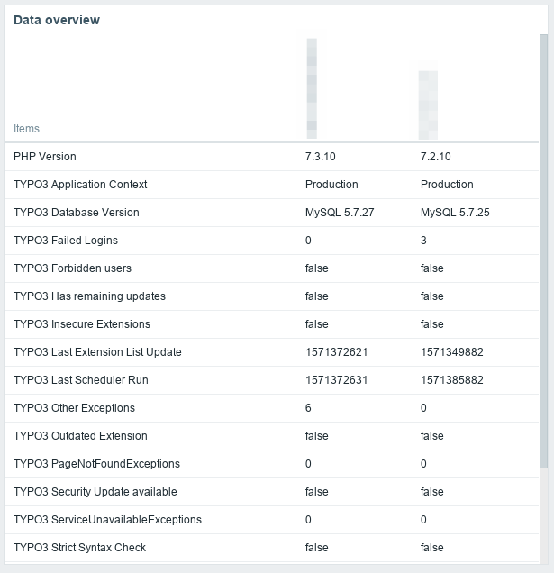
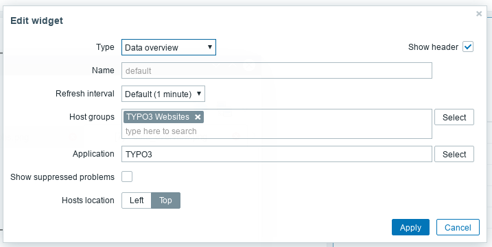

.. include:: ../Includes.txt

.. _installation:

============
Installation
============

.. _server:

Zabbix setup
============

.. rst-class:: bignums-xxl

1. Import

    Import the template *typo3conf/ext/zabbix_client/Resources/Private/ZabbixTemplate/typo3.xml* into your Zabbix system.

    .. figure:: ../Images/template_import.png
        :alt: Import template

2. Create a host and add this template

    .. figure:: ../Images/template_add.png
        :alt: Add the template

    .. figure:: ../Images/template_add2.png
        :alt: Add the template

    Important: You have to enter a DNS name / Domain / Subdomain (and set "Connect to" to DNS) or a IP address at "Agent interfaces".

3. Macro

    Add a macro in this host. The key is named {$TYPO3_CLIENT_KEY}. Set a long user-defined key.

    .. figure:: ../Images/host_macros.png
        :alt: Host macro

.. _client:

Client setup
============

.. rst-class:: bignums-xxl

1. Install the extension

2. Extension setup

    Set a key in the extension settings

    .. figure:: ../Images/typo3_ext.png
        :alt: Extension setting

3. Finished

    Everything necessary is now done. Zabbix can now be configured further.

.. _further-setup:

Further Zabbix setup
====================

Now you can add graphs and data overviews to your dashboard

Data overview
-------------

