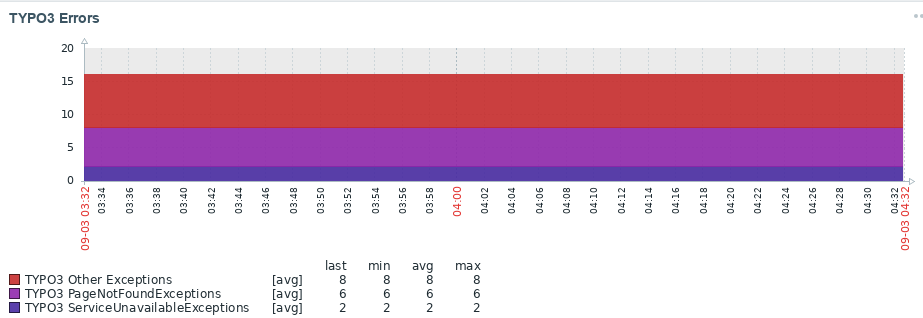

.. include:: ../Includes.txt

.. _introduction:

============
Introduction
============

.. _what-does-it-do:

What does it do?
----------------

The ``zabbix_client`` extension provides a JSON API for the Zabbix monitoring software.

Features List
-------------

With this extension you can detect:

* TYPO3 Errors
   * PageNotFoundExceptions
   * ServiceNotAvailableExceptions
   * Other Exceptions
* ....