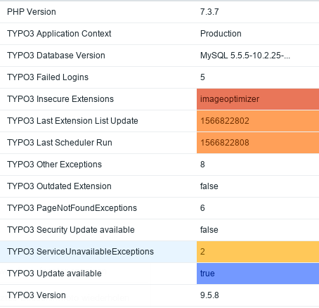
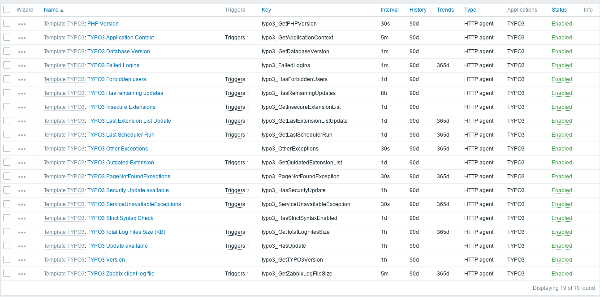
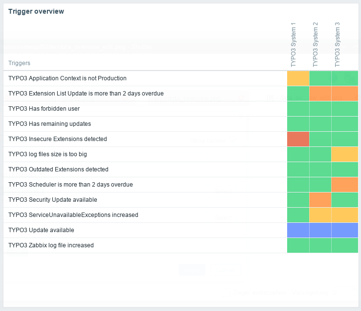
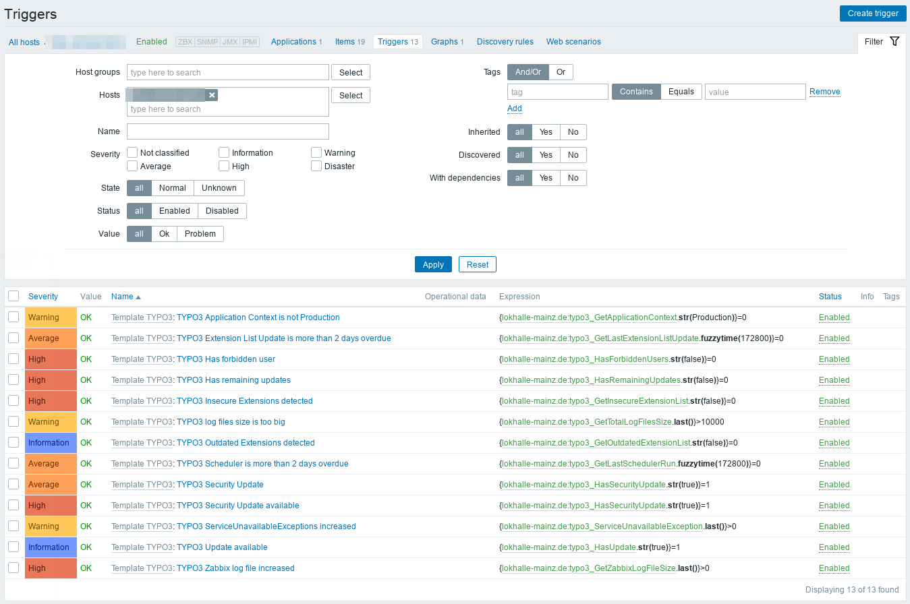

.. include:: ../Includes.txt

.. _introduction:

============
Introduction
============

.. _what-does-it-do:

What does it do?
----------------

The ``zabbix_client`` extension provides a JSON API for the Zabbix monitoring software.
With the help of this extension, the following goals will be achieved more closely:

* Improvement of the quality of TYPO3 websites (less errors)
* Preservation of quality
* Give agencies an overview of which customers use which systems
* Improvement of performance
* Improvement of security

Here you can see some examples of data.

.. figure:: ../Images/graph_error.png
   :alt: TYPO3 Error graph

Problems

Items

Triggers in dashboard

Triggers of template

Features List
-------------

With this extension you can detect:

* TYPO3 Errors
   * PageNotFoundExceptions
   * ServiceNotAvailableExceptions
   * Other Exceptions
* ....